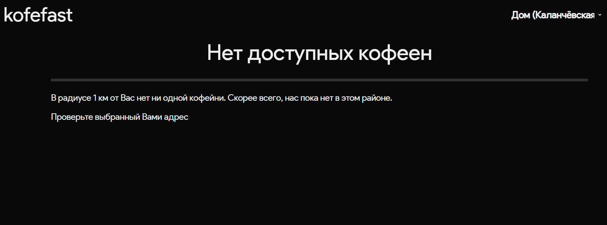
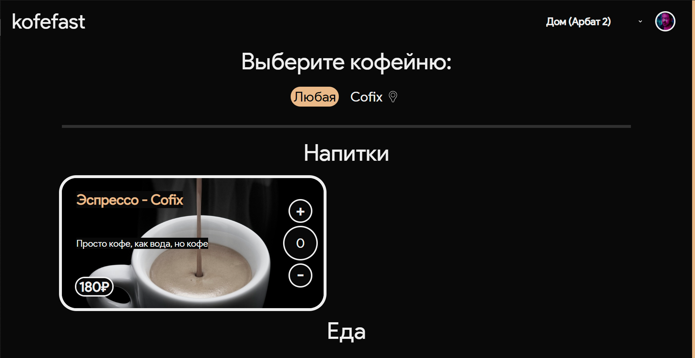
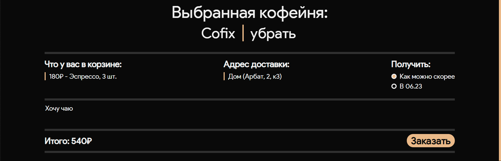
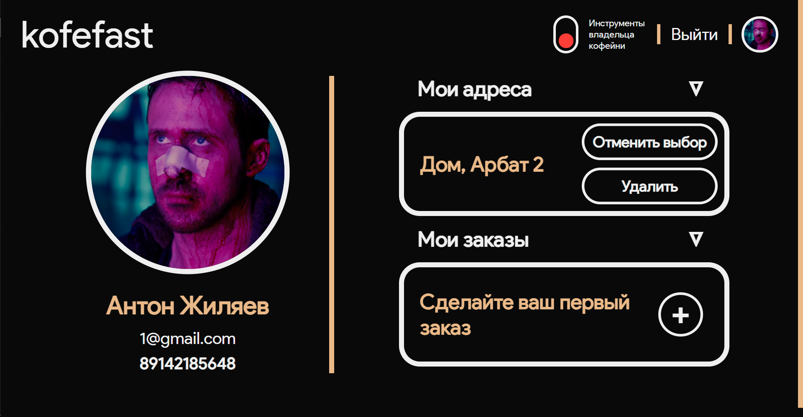
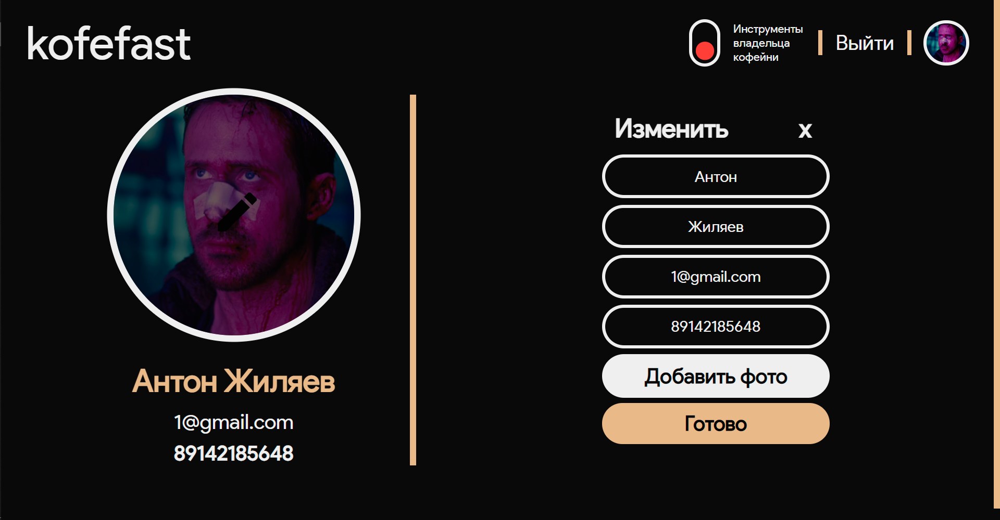
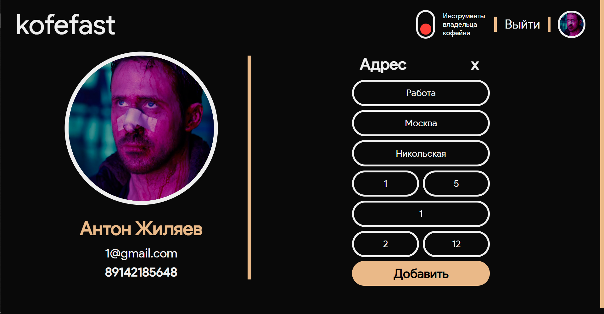
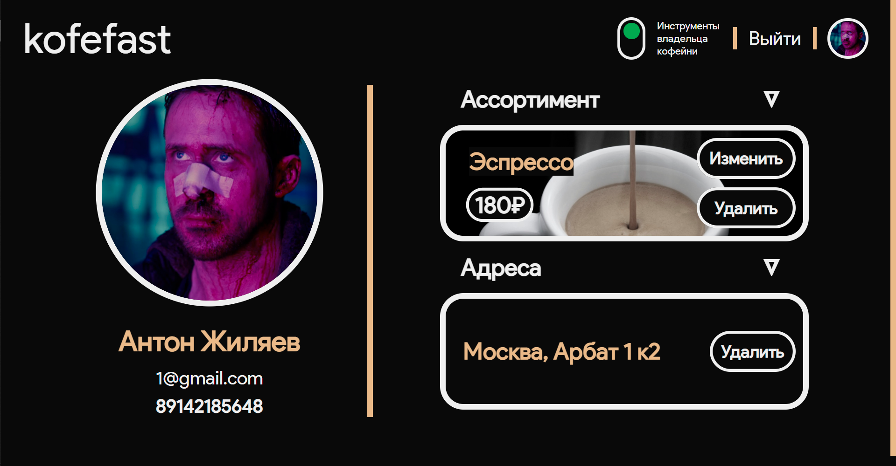

===============
Интерфейс сайта
===============

****************
Главная страница
****************

 - *Header* страницы содержит ссылку на *index.html*, возможность выбрать адрес, добавить адрес или перейти в личный кабинет
 - Кофейни будут отображаться, если они имеют **как минимум одно заведение в 1 км от пользователя**

Сообщение об отсутствие кофеен:

При наличие кофейни рядом вы увидите следующее:

Кнопки *'+' '-'* отвечают за добавление/удаление элемента из корзины
********************************************************************

**После добавления предмета в корзину, кофейня-провайдер закрепляется как выбранная**

Интерфейс корзины:

В корзине есть
--------------
 - Список товаров
 - Выбранный адрес
 - Время доставки
 - - *Как можно скорее*
 - - Через 15 от текущего времени
 - Поле для ввода комментария
 - Общая стоимость корзины
 - Кнопка заказать

**После совершения заказа, вам на почту придет письмо, сообщающее об успешном заказе через наш сервис**

**************
Личный кабинет
**************

*Интерфейс личного кабинета*

 - *Header* страницы содержит ссылку на *index.html*, возможность выйти из аккаунта, перейти в режим владельца кофейни (если вы являетесь владельцем кофейни)
 - Страница поделена на две части:
 - - Функции изменения профиля
 - - Просмотр сведений об аккаунте/кофейне

Смена параметров профиля
************************

*Имеется возможность установить картинку профиля, картинка должна иметь формат .png, .jpg, .jpeg*

*Добавление нового адреса*

**!Обязательно проверяйте грамматику в адресе; не подписывайте ул., д. и тд; буквы е и ё - разные буквы!**

Изменение кофейни
*****************

**!на момент релиза функционал объемов/добавок отключен!**

После каждого изменения на страницах пользователя переносит обратно на позицию, с которой он совершил это действие
******************************************************************************************************************